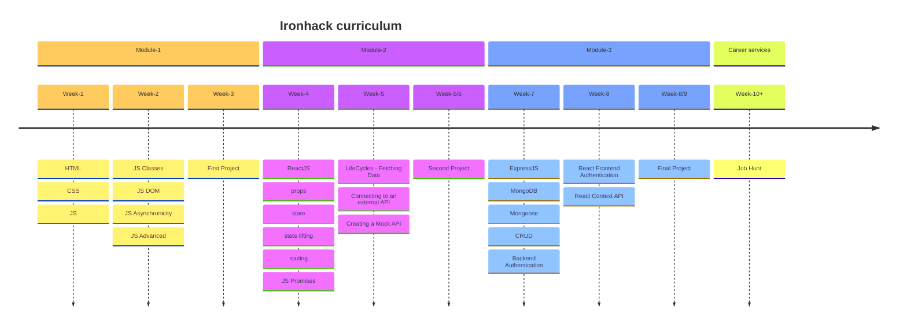
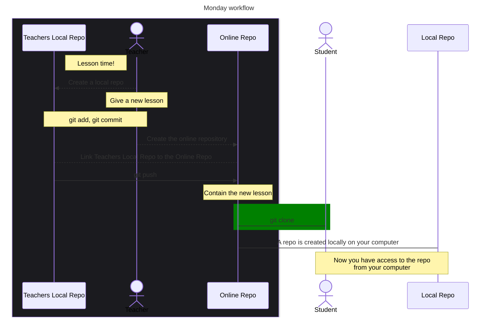
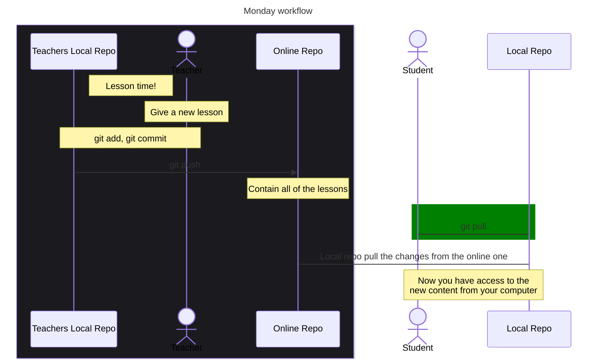

# Ironhack Web Dev

## Table of contents

1. [Welcome](#welcome-hackers-😎)
2. [Clone a repo](#get-the-code-on-your-computer)

### Welcome hackers 😎!

Starting 13th of May you will have 10 weeks to learn the fundamentals of Web Development.



### Content

<!--
- [Week-1]()
- [Week-2]()
- [Week-4]()
- [Week-5]()
- [Week-7]()
- [Week-8]()
- [Extra-Content]()
  -->

### Get the code on your computer

> [!NOTE]
> In this organisation you will find one repository for each week.
> You should **_not_ fork** the repositories but **clone them** instead (using `git clone`).

Here is the monday workflow, although it might look complex at a first glance, it's actually pretty straightforward on the student side.

You will just need to `clone` the repository once the teacher added all of the morning lesson to it.

> [!IMPORTANT]
> To clone a repo, use your terminal to go somewhere in your computer where you want to download the repository.
>
> ```bash
> git clone the-repo-url-ending-with .git
> ```



### Rest of the week workflow

> [!IMPORTANT]
> Once you have a locally cloned repository, if you want to get the new content added by the teacher, you don't need to make a new `clone`, you will just need the `pull` the changes



> [!WARNING]
> If you modify something in your local repo, you will not be able to download the new changes. In order to that you will need to use some other commands, namely `git stash` and `git stash pop`

You can open the terminal at the root of the repository and use the next commands.

```bash
git stash
git pull
git stash pop
```
